# Pharmaceutical Blister Pack Digital Twin

A closed-loop cyber-physical digital twin of a high-speed blister packaging line: procedural USD geometry, synthetic training data, a TensorRT detector and a three-thread controller that inspects, judges and physically rejects packs on a 240 Hz PhysX transport, all in one process.

[View Interactive Case Study ->](https://Turki-Ta.github.io/pharma-blister-digital-twin/)


Release: [v1.0.0](https://github.com/Turki-Ta/pharma-blister-digital-twin/releases/tag/v1.0.0) &middot; recorded run (MP4): [digital_twin_demo.mp4](https://github.com/Turki-Ta/pharma-blister-digital-twin/releases/download/v1.0.0/digital_twin_demo.mp4)

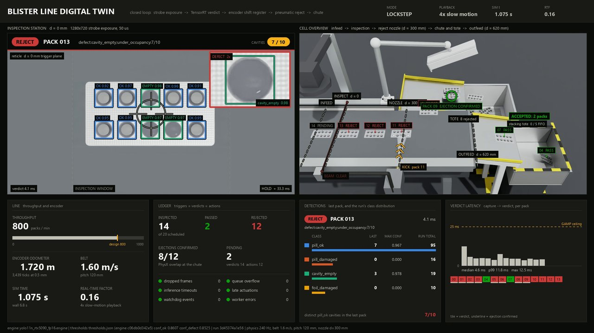

*Frame 128 of the recorded 20-pack run: the inspection pane shows three EMPTY boxes among seven OK boxes with a `cavity_empty 0.98` inset, while the overview pane shows orange chevrons and a KICK pack 11 label at the reject nozzle. Header reads LOCKSTEP, 4x slow motion, SIM t 1.075 s, RTF 0.16.*

## What this is

The repository contains a complete machine-vision inspection cell for a pharmaceutical blister line, built end to end: a procedurally generated USD pack and cell, a synthetic data generator that labels frames from the semantic mask, a YOLO11n detector exported to a TensorRT fp16 engine, and a three-thread controller (W1 capture, W2 inference, W3 encoder-clocked shift register and actuation) that turns detections into a physical action. The line itself is simulated as rigid-body physics: packs are 12 g dynamic bodies driven along a belt at 1.6 m/s, stepped at 240 Hz, triggered by a 0.5 mm-per-tick encoder at the inspection station and kicked by a pneumatic reject nozzle 300 mm downstream, with every ejection confirmed by a PhysX overlap query on the bin volume rather than assumed. Accepted packs run off the belt end onto a ramp and stack in an outfeed tote under a rolling FIFO. A dual-camera SCADA-style dashboard renders the inspection view and a cell overview side by side and records them to video, and every pack writes a Part 11-style append-only audit record at actuation. The host is Windows 11 with an RTX 5090 (32 GB) and Python 3.12 managed by `uv`; simulation, rendering and inference share a single process through `ovrtx` 0.4.1, `ovstage` 0.1.1 and `ovphysx` 0.5.11 (Isaac Sim is not used).

## Architecture

### The closed loop

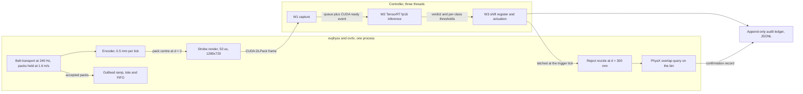

### The offline chain

```mermaid
flowchart LR
  A["Procedural USD asset<br/>blister_factory.py"] --> B["Synthetic data<br/>2,400 frames, mask labels"]
  B --> C["Train YOLO11n<br/>30 epochs, batch 128"]
  C --> D["Export ONNX 17<br/>and TensorRT fp16"]
  D --> E["Calibrate thresholds<br/>600 val frames, margin 0.05"]
  E --> F["Drift gate<br/>50 unseen frames"]
  F -->|"RETAIN ENGINE"| G["Twin runs, lockstep"]
  G --> H["Parity audit vs the v1 baseline"]
```

### One pack, trigger to ledger

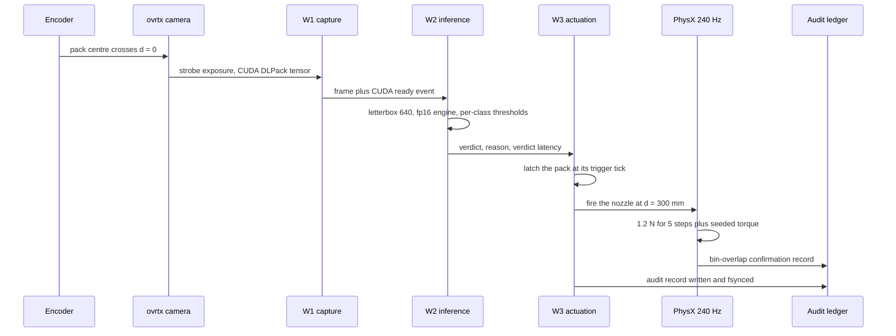

### Cell stations

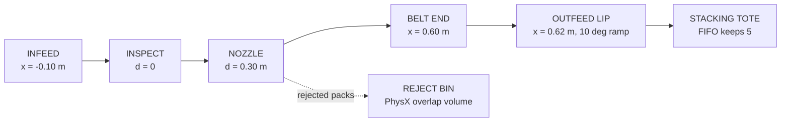

## Benchmarks

### Inference latency

Batch 1, 640x640, 500 timed iterations after 50 warm-up (200 iterations for the eager baseline), measured on the RTX 5090.

| Path | Median (ms) | Mean (ms) | p99 (ms) | Min (ms) |
| --- | --- | --- | --- | --- |
| TensorRT fp16 engine | 1.209 | 1.218 | 1.467 | 1.032 |
| TensorRT fp32 engine | 1.317 | 1.320 | 1.578 | 1.111 |
| PyTorch fp32 eager | 3.307 | - | 4.274 | - |
| Twin capture to verdict, 20-pack run | 4.69 | - | 11.49 | 3.38 |

The 1.21 ms figure is **engine inference only**. The number that governs the line is the twin's capture-to-verdict latency, median 4.69 ms and p99 11.49 ms, measured inside the running twin against a 25 ms budget; the slowest single pack was the first at 12.46 ms. A verdict that misses the budget is not trusted and the pack is rejected (fail-closed). Across the recorded run: 20 frames, 20 inferences, 0 overflow, 0 dropped frames, 0 timeouts, 0 late actuations, 0 watchdog events, 0 errors, 20 audit records.

Numerical parity, 200 reference boxes over 20 images: PyTorch vs ONNX Runtime CUDA is exact at the box level (min IoU 1.0, 0 class mismatches); TensorRT fp16 vs PyTorch gives mean IoU 0.9990 with 0 class mismatches.

### Training

| Quantity | Value |
| --- | --- |
| Dataset | 2,400 synthetic frames, seed 20260917 |
| Split | 1,800 train / 600 val (every 4th frame) |
| Labels | 24,000 boxes from the semantic mask, mask-vs-projection IoU median 0.839 |
| Model, schedule | YOLO11n, 30 epochs, batch 128 (32/64/128 swept, all accepted), bf16/tf32 |
| Wall time | 208.2 s (450 steps, step median 250.5 ms) |
| Peak allocation | 17.61 GB, 0 non-finite steps, 0 skipped steps |
| mAP50 / mAP50-95 | 0.995 / 0.9754 |
| Recall, all four classes | 1.0 |
| Precision | pill_ok 1.0, pill_damaged 0.9998, cavity_empty 0.9981, foil_damaged 0.9999 |

Calibrated decision thresholds are derived from the 600 frozen validation frames with a 0.001 miss budget and a 0.05 out-of-sample margin: conf_ok 0.8607, conf_defect 0.8525; per class pill_ok 0.8607, pill_damaged 0.8711, cavity_empty 0.8908, foil_damaged 0.8525; NMS IoU 0.7, dedupe IoU 0.45. On the validation split those thresholds produce 0 false rejects over 218 nominal packs and 0 escapes over 382 defective packs.

### Drift gate

50 fresh frames rendered at seed 20260918, a seed never used for a dataset, scored with the shipped engine and the shipped thresholds.

| Class | GT boxes | Detected | Recall | False positives |
| --- | --- | --- | --- | --- |
| pill_ok | 368 | 368 | 1.0 | 0 |
| pill_damaged | 38 | 38 | 1.0 | 0 |
| cavity_empty | 46 | 46 | 1.0 | 0 |
| foil_damaged | 48 | 48 | 1.0 | 0 |

Pack level: 15 nominal, 35 defective, 0 false rejects, 0 escapes. Localisation IoU mean 0.969 against the reference validation batch at 0.9701, inside the 0.02 tolerance. Gate verdict: **RETAIN ENGINE**. The gate also requires that the engine SHA-256 recorded in `thresholds.json` equals the hash of the engine being scored.

### Twin runs

All runs 2026-09-17, pool 16, lockstep, 240 Hz physics, seed 20260911 unless stated.

| Run | Verdicts matched | Ejected and PhysX-confirmed | Nominal passed clean | Stacked in outfeed | FIFO recycles | Forced | Lost | RTF |
| --- | --- | --- | --- | --- | --- | --- | --- | --- |
| 20 packs, recorded | 20/20 | 17/17 | 3/3 | 3 | 0 | 0 | 0 | 0.168 |
| 30 packs, baseline | 30/30 | 24/24 | 6/6 | 6 | 1 | 0 | 0 | 0.814 |
| 30 packs, seed 1 | DEMO PASS | - | - | 9 | 4 | 0 | 0 | - |
| 50 packs, default seed | DEMO PASS | - | - | 10 | 5 | 0 | 0 | - |
| 12 packs, `--realtime` | 12/12 | - | - | - | - | - | 0 | 0.416 |

Verdict latency medians: 4.69 ms (20-pack) and 4.87 ms (30-pack). Outfeed settle time median 0.483 s, maximum 0.5 s on the recorded run; 0.5 s median and 1.229 s maximum on the seed-1 robustness run. The realtime run recorded 0 timeouts: the first inference is slower under GPU contention with the overview renders, the fail-closed path handled it, and the verdict was unchanged.

**Parity vs the v1 baseline** (`scripts/parity_v2.py`): **PASS** - identical verdicts, actions and physical outcomes pack for pack on both the 20- and 30-pack runs. The v1 verdict medians were 5.34 ms and 5.11 ms. Renderer leak lines: 0 in all four logs.

Recorded-run overheads, for context: 517 physics steps, 616 guarded renderer steps, 20 frames pushed over the CUDA DLPack path, sim 2.154 s in 12.8 s wall. The dashboard produced 273 display frames at 30 fps and 0.25x real time, per frame medians mirror 3.99 ms, overview render 33.48 ms, HUD compose 28.77 ms, encode 1.27 ms, and the video is 9.1 s of 1920x1080 at 3,343,952 bytes. Torch allocation moved 4.9 MB to 8.5 MB (peak 25.2 MB) and GPU used memory went 6245 MB to 5921 MB across the run.

### Mathematics behind the numbers

- **Why the trigger is encoder-clocked.** At 1.6 m/s a 240 Hz physics step advances the pack 1.6 / 240 = 6.67 mm. A per-step raycast beam would therefore quantise the trigger to 6.67 mm of position jitter, so the trigger is clocked by a 0.5 mm-per-tick encoder instead and the on-screen beam is only an indicator.
- **Reject impulse.** 1.2 N applied for 5 steps at 240 Hz is 1.2 x 5/240 = 0.025 N.s = 25 mN.s. On a 12 g pack that is 0.025 / 0.012 = 2.1 m/s of lateral velocity, plus a seeded roll and yaw torque about the centre of mass so no two ejections look identical.
- **Outfeed hand-off.** Accepted packs leave the belt collider at x = 0.60 m and become free bodies. The ramp lip sits at x = 0.62 m, 6 mm below the belt top, at 10 degrees over 0.20 m. The pack is airborne for roughly 11 cm and first touches the ramp at about x = 0.73 m, then slides. Steeper ramps of 12 to 16 degrees were overflown - the pack cleared the ramp before contacting it - which is why 10 degrees was chosen.
- **Body pool budget.** 16 = 6 on the belt (the spawn point at -0.10 m to the belt end at 0.60 m at 120 mm pitch) + 2 in reject transit + 1 spare reserved, with up to 7 bodies in the outfeed; the rolling FIFO keeps 5 settled packs and recycles the oldest into the pool when the sixth settles.
- **Design rate.** 1.6 m/s over a 120 mm pack pitch is 1.6 / 0.12 = 13.3 packs per second, i.e. 800 packs/min.

## GAMP 5 / Part 11 design summary

The system is structured as a **GAMP 5 Category 4 (configured product) pattern**: a standard detector and a standard physics engine, configured and parameterised for this process, with the configuration itself treated as the controlled artifact.

- **Thresholds are derived, not tuned by hand.** They come from recall-driven per-class quantiles on the frozen 600-frame validation split, minus a 0.05 out-of-sample margin, under a 0.001 miss budget. The derivation is a script (`src/inference/calibrate_thresholds.py`) and its output (`models/exported/thresholds.json`) records the inputs it used.
- **Model identity is pinned.** The TensorRT engine's SHA-256 (`c06db0d3...`) is written into `thresholds.json` and into every audit record, so a record states which binary judged the pack. A mismatch between the thresholds' engine hash and the loaded engine fails the drift gate.
- **Fail-closed on time.** The inference budget is 25 ms. A verdict that arrives late or slow is not trusted and the pack is rejected; the HUD draws the budget as the GAMP ceiling line so the margin is visible during a run.
- **Deterministic replays.** Runs execute in lockstep with a seeded scheduler, so a run can be repeated and compared step for step.
- **Change control.** Any model or asset change must pass the drift gate (integer recall 1.0 per class, 0 pack-level false rejects and escapes, localisation IoU within 0.02 of the reference batch) and then a parity audit against the previous baseline before it is used.
- **Audit trail.** `reports/audit_trail.jsonl` is an **append-only, fsync-per-record, engine-SHA-256-pinned JSONL** ledger, schema `blister.audit/1`, one record per pack written at actuation, carrying run id, controller version, engine SHA-256, host, pack id, UTC timestamp, encoder ticks at trigger and at action, frame id, per-detection class confidences, verdict, reason, verdict latency, late-verdict flag, actuation status and the thresholds in force. The twin appends `blister.confirm/1` PhysX overlap confirmations to the same file under the same lock. The local ledger holds 1,416 records at v1.0.0.

**This is a design pattern demonstrated on a simulator.** It is not a validated, audited or certified system, it has not been assessed by any regulator, and nothing here constitutes regulatory approval or a claim of compliance. The Part 11 wording describes the ledger's structural properties listed above and nothing more. Note also that the audit ledger is not hash-chained record to record: the SHA-256 in each record identifies the engine binary, not the previous record.

## Repository layout

```
src/simulation/    blister_factory.py (procedural USD pack and cell), sdg_pipeline.py
                   (synthetic data plus mask labels), ovx_runtime.py (ovrtx/ovstage/ovphysx
                   wrapper), live_factory_twin.py (the closed-loop twin), twin_hud.py (dashboard)
src/training/      train.py (YOLO11n training with the batch sweep)
src/export/        export_engine.py (ONNX 17 export, TensorRT fp16/fp32 build, parity, latency)
src/inference/     controller.py (W1/W2/W3 controller and audit ledger),
                   calibrate_thresholds.py, drift_check.py
scripts/           final_v3.sh (full verification sweep), parity_v2.py, retrain_v2.sh
assets/            pack.usda / pack.json (v2 asset), v1/ (the previous asset for comparison)
models/exported/   thresholds.json, export_summary.json, per-engine JSON metadata,
                   Jetson Orin build script and INT8 calibration stub
models/            summary_yolo11n_v2.json and the other run summaries
reports/           final_v3.log, drift_check.json, audit_trail.jsonl,
                   twin/ (per-run JSON metrics, logs, stills, recorded video), twin/v1/ (baseline)
showcase/          the case-study site and showcase/media/ (figures with manifest.json)
```

### What is not in the repo

Everything that is regenerated by the commands below: `data/` (the 2,400 rendered frames and labels), trained weights, the exported ONNX files and the TensorRT engines. TensorRT engines are bound to the GPU architecture and TensorRT version that built them, so they are rebuilt locally rather than shipped. The `yolo11n.pt` starting weights are downloaded by ultralytics on first training run.

## Reproduce

```bash
uv sync                                                                                   # resolve and install the pinned environment
uv run python src/simulation/assets/blister_factory.py --render-check                      # build the USD pack and cell, render a preview
uv run python src/simulation/sdg_pipeline.py --frames 2400                                 # synthesise the dataset and label it from the semantic mask
uv run python src/training/train.py --name yolo11n_v2 --epochs 30 --sweep-batches 32,64,128 # sweep batch size, then train YOLO11n
uv run python src/export/export_engine.py --best models/runs/yolo11n_v2/weights/best.pt    # export ONNX, build the TensorRT engines, check parity and latency
uv run python src/inference/calibrate_thresholds.py --margin 0.05                          # derive per-class thresholds on the frozen validation split
uv run python src/inference/drift_check.py --frames 50                                     # run the drift gate on unseen frames
uv run python src/inference/controller.py --test                                           # controller self-test: 20 validation frames on a simulated belt with injected faults
uv run python src/simulation/live_factory_twin.py --demo --packs 20 --pool 16 --lockstep --record-video  # the recorded 20-pack closed-loop run
uv run python src/simulation/live_factory_twin.py --demo --packs 30 --pool 16 --lockstep    # the 30-pack stress run
uv run python scripts/parity_v2.py                                                          # parity audit against the v1 baseline
bash scripts/final_v3.sh                                                                    # the full verification sweep that produced reports/final_v3.log
```

## Visual evidence

### Asset v1 and asset v2

| v1 | v2 |
| --- | --- |
| 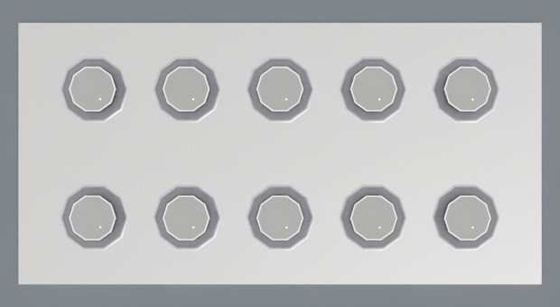 | 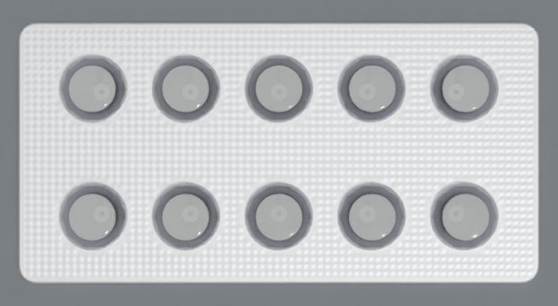 |
| The v1 pack, cropped: a straight, sharp-cornered card edge and octagonal dome facets, with the flat disc face of each tablet visible inside. | The same crop box on the v2 pack: rounded card corners, the knurled seal pattern across the card face and domed, biconvex tablets. |

Textures do not load on this `ovrtx` build, so all micro-detail in v2 is geometry: a 3 mm corner radius with a 0.3 mm chamfer, lathe-built biconvex tablets, an 80 um knurl at 1.25 mm pitch, OmniGlass PVC domes at ior 1.53 and a coaxial ring light randomised 0.5x to 1.5x during data generation.

### What the detector actually consumed

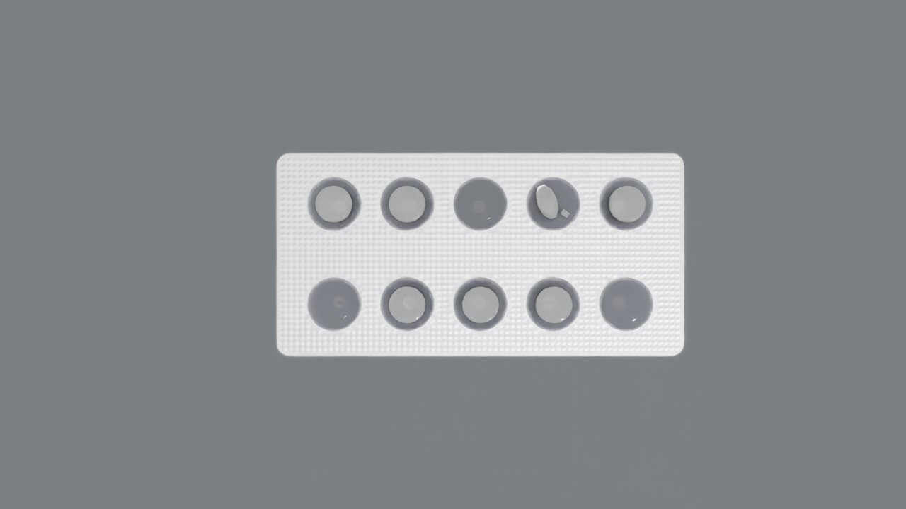

*The raw strobe exposure with no HUD overlay: the v2 pack centred against the belt, three cavities holding no tablet, one holding a broken tablet with a loose fragment beside it, and the remaining six holding intact tablets.*

### The defect inspector

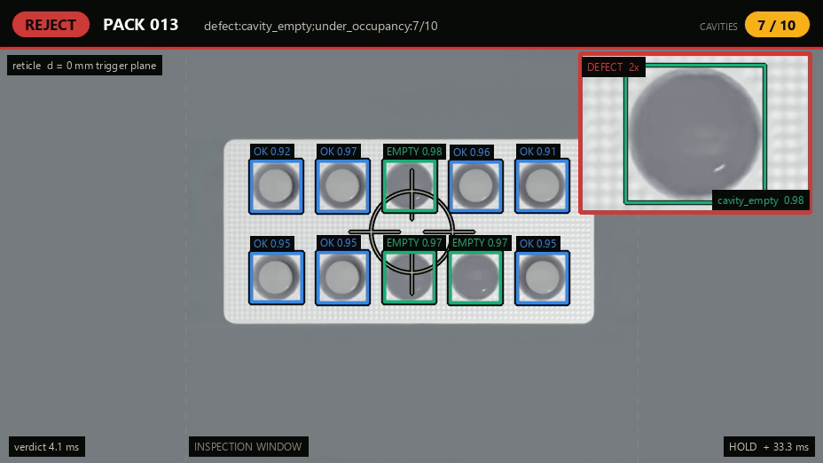

*The inspection pane for PACK 013: a red REJECT badge, reason `defect:cavity_empty:under_occupancy:7/10`, a 7/10 cavities counter, seven blue OK boxes, three green EMPTY boxes (0.98, 0.97, 0.97) and a magnified inset of an empty dome labelled `cavity_empty 0.98`.*

The 2x picture-in-picture inset, one per class:

| | | | |
| --- | --- | --- | --- |
| 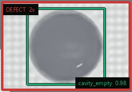 | 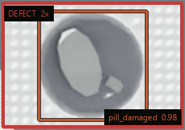 | 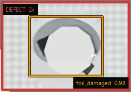 | 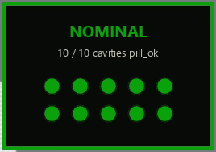 |
| A smooth empty blister dome with no tablet inside, ringed by a green detection box tagged `cavity_empty 0.98`. | A dark dome holding a bright angular tablet chunk set off-centre with a small loose fragment beside it, ringed by an orange box tagged `pill_damaged 0.98`. | A cavity whose lidding shows a dark crescent gap along one edge and a dark notch at the opposite edge around a bright tablet face, ringed by a yellow box tagged `foil_damaged 0.98`. | On a PASS the inset is replaced by a green NOMINAL card, subtitled 10 / 10 cavities pill_ok, with ten green dots in two rows of five. |

### The cell overview

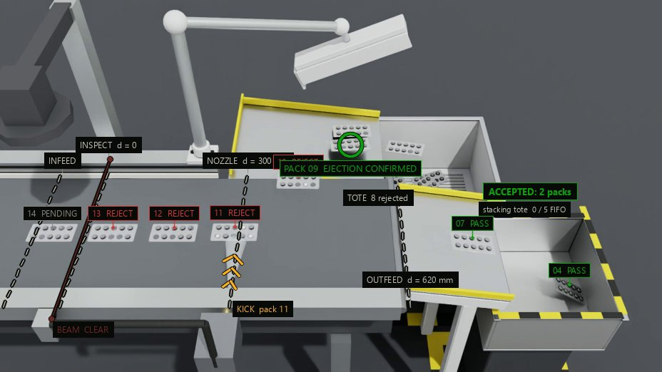

*The moment of the pneumatic reject: three orange chevrons rise from a KICK pack 11 label toward the pack tagged 11 REJECT at the NOZZLE d = 300 mm station, PACK 09 EJECTION CONFIRMED flashes green next to the chute, packs 07 PASS and 04 PASS sit on the outfeed ramp, and the counter reads ACCEPTED: 2 packs, stacking tote 0 / 5 FIFO.*

| Outfeed slide | End of run |
| --- | --- |
| 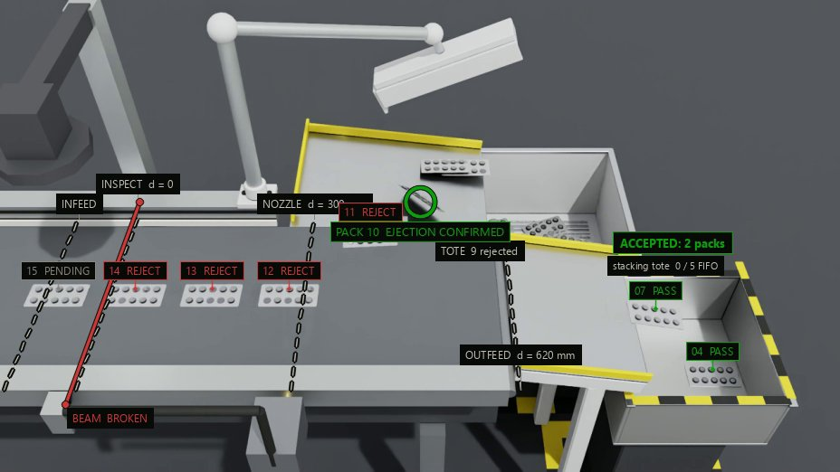 | 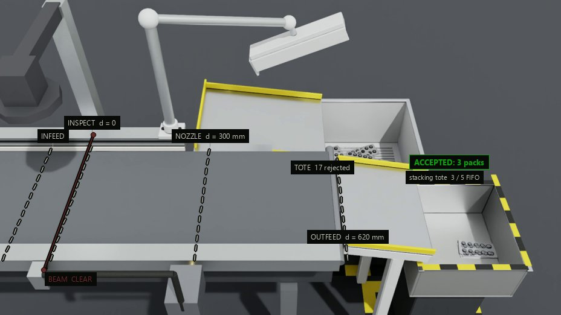 |
| The pack tagged 07 PASS part-way down the yellow-edged outfeed ramp and 04 PASS further along toward the tote, a green PACK 10 EJECTION CONFIRMED flash beside the reject chute, BEAM BROKEN at the infeed, counter at ACCEPTED: 2 packs, stacking tote 0 / 5 FIFO. | The end state of the 20-pack run: the belt is empty with BEAM CLEAR at the infeed, loose rejected tablets and packs lie in the reject tote marked TOTE 17 rejected, a stack of accepted packs rests in the outfeed tote, counter at ACCEPTED: 3 packs, stacking tote 3 / 5 FIFO. |

### Where it started

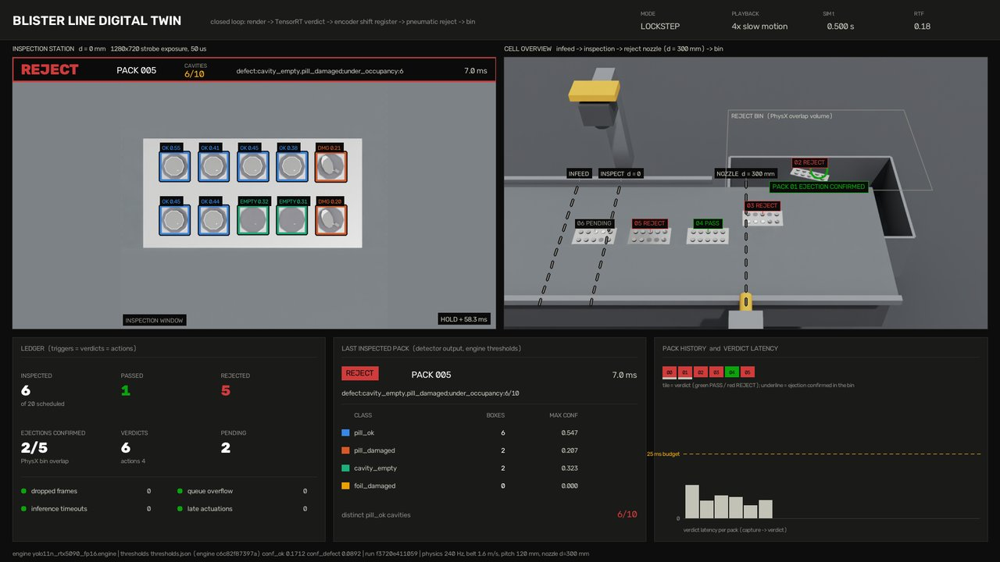

*The v1-era dashboard on a REJECT of PACK 005, whose per-box confidences read 0.21-0.55 rather than the v2 run's 0.9x, with a REJECT BIN (PhysX overlap volume) in the overview instead of a chute and tote, and a PACK HISTORY and VERDICT LATENCY panel at bottom right. The parity audit confirms the v2 line reproduces the v1 verdicts and physical outcomes pack for pack.*

---

Figures and numbers on this page are sourced from `reports/twin/twin_lockstep_20.json`, `reports/final_v3.log` and `models/exported/export_summary.json`.

[View Interactive Case Study ->](https://Turki-Ta.github.io/pharma-blister-digital-twin/)
